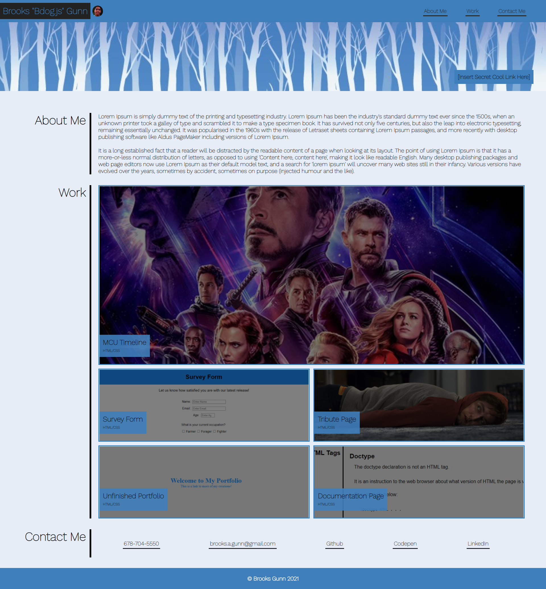

# my-portfolio-website_BG
Brooks Gunn's Portfolio Website

## HTML
* Used semantic elements throughout

* Linked to Reset and Style stylesheets

* Built a fixed navbar with my name, a profile picture, and working links to sections in the page

* Built a header with an image for a background and captioned text inside

* Specified main content with "main" tag

* Vertical bar separates the large section name and text in each section
* Section 1: "About Me" section with biographical text
* Section 2: Work 
* Section 3: "Contact" section includes my phone number, links to my Github, Codepen, and LinkedIn, and a "mailto" with my email

* "Work Section" includes the main content of the page - cards which bear my portfolio projects and link to them; There are 5 cards in total, and each has a project name and resources used each wrapped in a span tag

* Footer has my name and the year, 2021, at the bottom of the page
## CSS
* **Reset**
* Reset file makes sure margin and padding are 0 by default

* **Style**
* CSS flows logically per section (set in CSS itself with comments)
* For setup, a font is imported and all elements are given the font-family "Work Sans"; a root psuedo-class contains color variables that replace pallette colors
* **TAGS**

* _NAV SECTION_
* The navbar is fixed
* Undecorated links are centered vertically and pushed to the right of the page; a solid border is also added under the links replacing their default underline with something more robust
* Colors specified in the root are used to color all elements

* _HEADER SECTION_
* Header is pushed down to avoid overlap
* Header is composed of a background-image and a captioned push to the bottom right corner of the element

* _BODY_
* Background color for page is specified 

* _MAIN_
* Main content is pushed down to avoid overlap

* _SECTIONS IN MAIN_
* Sections are turned into flex containers since they will be one-dimensional rows
* Dimensions and text attributes are specified

* _FOOTER_
* Is the same color as navbar with centered copyright text

**IDs**

* _NAV SECTION_
* Logo text is colored with the blue pallette color and the gray pallette color for the rectangular background
* The profile picture is made circular and is positioned next to the logo text element

* _CARD CONTAINER_
* The work cards are held in a container that uses CS Grid; This allows for ridiculously simple setup
* A template specifies the area the cards will cover in two dimensions; the top card covers two columns
* Gaps between items are specified

* _CARDS_
* Each card is assigned to a grid area with the top card covering the widest area and the rest covering equal areas

* _CONTACT SECTION_
* List items are stripped of decoration, put in a row, and spaced evenly
* A bottom border replaces the default link underline
* Gray pallette color employed for coloration

* _PHONE IN CONTACT_
* I wanted this to be a link but I didn't want it to be clickable for... purposes.

**CLASSES**
* _SECTION SECTION_
* Section text to the left of a vertical bar is made large and introductory
* Content ton the right of a vertical bar is given dimension specifications
* The big and small cards are given separate height specifications, but a similar border

* _CARD CONTENT AND TRANSITIONS_
* Card ::before pseudo-elements have a background image that is positioned in the center of the box and fill it; They give the images a brightness of half and set the transition for later
* Card :hover::before elements turn the cursor into a pointer and maximize the brightness
* Card content is flexed and pushes the blue background text captions to the bottom of the bottom left of the box; dimensions for the text are specified

* _CARD TEXT_
* Project text is the first span in the paragraph text of the card caption element; it is given a bigger font than the resources span

* _MEDIA QUERIES_
* 1230px: Card content is changed to be a single column
* 1160px: The large introductory text in each section is shrunken down
* 900px: Project caption is shrunken down
* 800px: Logo font size and nav list padding are made smaller
## LINKS
https://github.com/WorldUnfurled/my-portfolio-website_BG
## E-SIGNATURE?
Brooks Gunn :)

